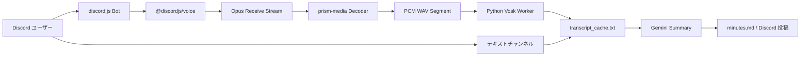

# discord.js 版アーキテクチャ

## 概要

このプロジェクトは、Discord Bot 自身が VC に参加して音声を受信し、発言ごとに音声チャンクを切り出して Vosk で文字起こしし、会議終了後に Gemini で要約する構成です。

Bot の責務は Node.js 側へ集約し、Vosk だけを Python ワーカーとして分離しています。

## 全体フロー

## コンポーネント

### `src/bot.js`

- Discord クライアント生成
- Slash Command 登録
- `/start` `/stop` 実装
- `messageCreate` によるテキストチャンネル記録
- `voiceStateUpdate` による自動 stop

### `src/session.js`

- 会議セッション単位の状態管理
- VC 音声受信
- 無音区切りの音声チャンク化
- 音声チャンクの転記順序管理
- stop 時の要約生成、成果物出力、VC 切断

### `src/transcript-pipeline.js`

- 文字起こし結果の書き込み順序制御
- テキスト投稿と音声文字起こしの統合
- `transcript_cache.txt` 追記

### `src/python-transcriber.js`

- Python ワーカープロセス起動
- JSONL ベースの IPC
- Vosk 処理要求の送受信

### `scripts/transcribe_worker.py`

- Vosk モデルの常駐ロード
- FFmpeg による 16kHz mono への正規化
- Vosk 実行
- JSONL で結果返却

### `src/gemini.js`

- Gemini API 呼び出し
- JSON 形式で要約 / 決定事項 / TODO を取得

## 音声処理

1. `receiver.speaking.on('start')` で話し始めを検知
2. `receiver.subscribe(userId, { end: { behavior: AfterSilence } })` で受信開始
3. Opus を `prism-media` で PCM デコード
4. PCM を WAV 化して一時ファイルへ保存
5. Python ワーカーへ渡して Vosk で文字起こし
6. 発言開始順を保ったまま transcript に追記

## テキスト処理

- `/start` を実行したテキストチャンネルだけを監視
- 通常メッセージ本文を transcript に追記
- 添付ファイルは `[添付] filename` 形式で記録
- 表示名の末尾に `[text]` を付けて音声発言と区別

## stop 時の処理

1. 新規音声受信停止
2. 進行中の音声チャンクを強制確定
3. VC から切断
4. 未処理キューをすべて消化
5. transcript 全文を Gemini へ送信
6. `minutes.md` を生成
7. Discord テキストチャンネルへ送信

## 採用理由

- Discord Voice の現状を踏まえ、Voice 層は `discord.js` / `@discordjs/voice` に寄せた
- Python は Vosk 実行だけに限定し、Bot 制御は Node.js へ統一した
- transcript は逐次追記し、stop 時の単一失敗で全体が失われにくいようにした
